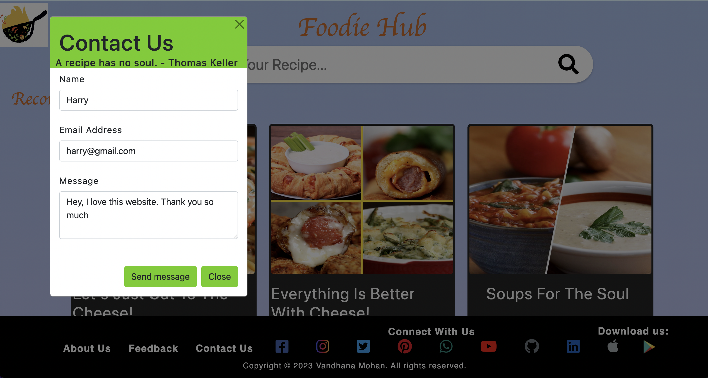
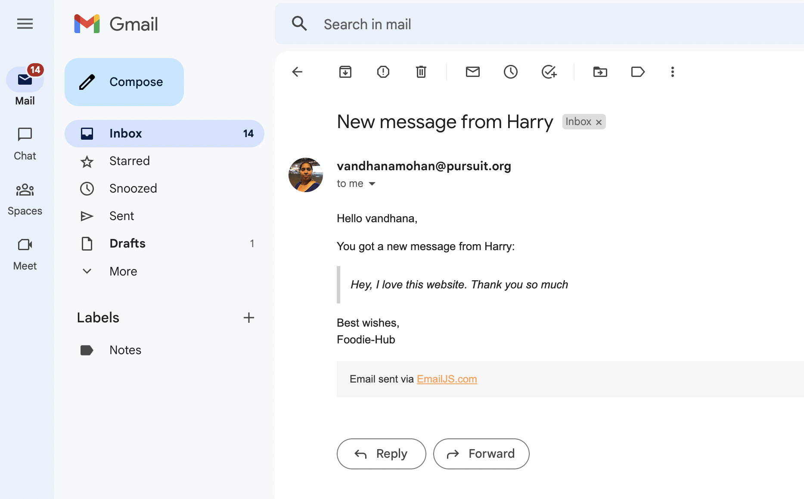

# Foodie-Hub
     > Food is symbolic of Love when words are inadequate - Alan D. Wolfelt

[Foodie-Hub](https://thefoodiehub.netlify.app/) is an online platform that simplifies recipe searching and cooking with its user-friendly interface, vast collection of recipes, and ability to search by ingredient or cuisine.

Comfort food is the best, and when you cook with love, it's delicious. Have you ever had the thought, 'I loved the fried rice at that restaurant...I wish I could have my mom's soup now'? Foodie-Hub solves all of your recipe-related issues.

# Watch Presentation
[Presentation](https://us06web.zoom.us/rec/share/LDWd5a7G--cVNBe4i5te83u0400-xRfH0xwe5isZzBnYmgbaXxVNokU8nZ7Fj2Db.08PpInZBd5zEzLWA)

Passcode: W#V8*#TQ

# Project Overview
Foodie-Hub offers a vast collection of recipes from different cuisines and ingredients. It allows users to search for recipes using any ingredient or cuisine they desire, making cooking and meal planning easy and convenient. With its user-friendly interface and advanced search options, Foodie-Hub provides a seamless experience for users looking to discover new recipes and elevate their cooking skills. Additionally, it also offers features like user reviews, feedback and contact us.

# Skills
Skills:

- HTML: Used to create the structure and layout of web pages.
- CSS: Used to style and format web pages.
- Bootstrap 5: A front-end framework that provides pre-designed elements and layout options.
- JavaScript: A programming language that allows you to add interactivity and dynamic behavior to web pages.
- Git: A version control system that allows you to track changes to your code and collaborate with others.
- Local storage: A web technology that allows you to store data on the user's browser so it persists even if the user closes the browser or navigates away from the website.
- Multiple API integration: Incorporating data from remote sources using APIs (Application Programming Interface)

# Design
* Utmost care taken to keep the design easy and flexible: The design of the website is user-friendly and easy to navigate, which makes it easy to search for recipes and use the website's features.
* Responsive design: The website is designed to be accessible on different devices and screen sizes.
* Color palette, typography, and layout: A consistent color palette, typography, and layout have been used throughout the website to make it visually appealing and easy to read.
* Feedback form data saving: The feedback form data is saved in the user's browser using local storage, so the form data will persist even if the user closes the browser or navigates away from the website.
* Contact Form message sent by the user can be received by the developer in their email inbox.

#### [Click Here](https://thefoodiehub.netlify.app/) - Visit my website to find your recipe from a huge collection, _cook, eat and enjoy!!!_

---
#### Home Page

---

#### Do leave me a feedback so I can improve. 

---

#### Read our other reviews 

---

#### Contact Us 

---

#### About Us 

---

#### Footer - Follow Us

---

# Project setup
---
## Getting started

1. Fork and clone this repository.
2. Navigate to the cloned repository's directory on your command line. Then, run the following command:

     > npm install

This will install the libraries needed to run the tests.

1. Open up the repository in VSCode.
2. Contact me in Github - link in website footer.

# Version 2 Updates

- Additional features for nutrition and calorie information: Users will be able to learn more about the nutritional content and calorie information of recipes before searching for them.
- Use of multiple APIs: The website will be able to fetch data from multiple APIs to provide more comprehensive information to users.
- Multiple search features: The website will have additional search options and filters to make it even easier for users to find the recipes they're looking for.
- More Bootstrap: The website will make use of more features and functionalities provided by Bootstrap 5 to improve the user experience.
- Dark mode settings: Users will be able to toggle between a light and dark mode to customize the website's appearance.
- Background color palette: Users will be able to choose from a range of background color options to personalize the website's appearance.
- More updates: There may be more updates and new features added in the future.

# Future Project Updates

Currently working on

    * Weather App Project
    * Personalized Art App where you can display your art work and video links
    * Nutrition App Project
    * Build a game

