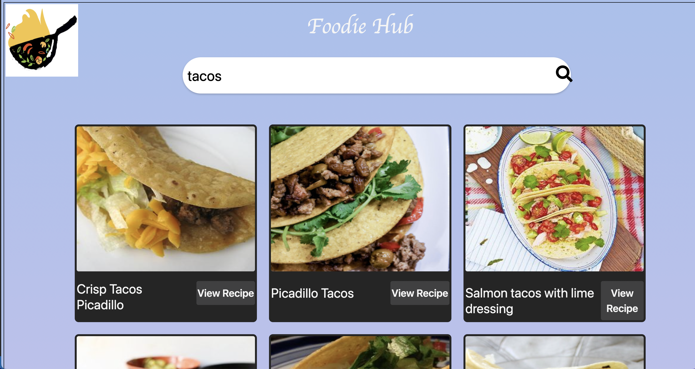
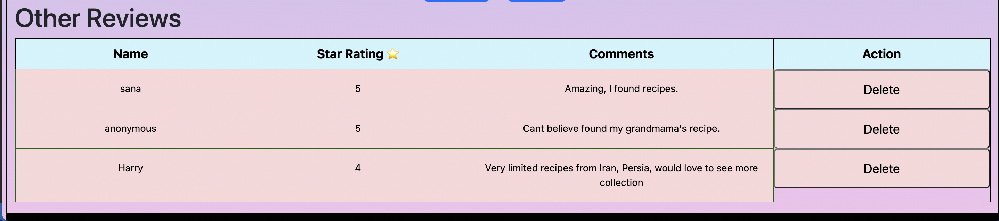

# Foodie-Hub
     > Food is symbolic of Love when words are inadequate - Alan D. Wolfelt

This hub is the destination to all your recipe search and cooking needs

Comfort food is the best and when you cook with love its delicious. 
Does this ever come across your mind, I loved the fried rice in that restaurant..., 
I wish could have my mom soup now *Foodie Hub* solves all your recipe issues

# Project Overview
This website allows to search recipe with any ingredient or cuisine.

# Design
Utmost care has been taken to keep design easy and flexible.

#### Visit my website, find your recipe from a huge collection, _cook, eat and enjoy!!!_

---
#### Home Page

---

#### Do leave me a feedback so I can improve. 

---

#### Read our other reviews 

---

#### Contact Us 

---

#### About Us 

---

#### Footer - Follow Us

---

# Project setup
---
## Getting started

1. Fork and clone this repository.
2. Navigate to the cloned repository's directory on your command line. Then, run the following command:

     > npm install

This will install the libraries needed to run the tests.

1. Open up the repository in VSCode.
2. Contact me in Github - link in website footer.

# Version 2 Updates

Version 2 will have additional features so you can learn more about nutrition and calorie before searching for recipe.

# Future Project Updates

Currently working on

    *Weather App Project
    *Personalized Art App where you can display your art work and video links
    *Nutrition App Project
    *Build a game

